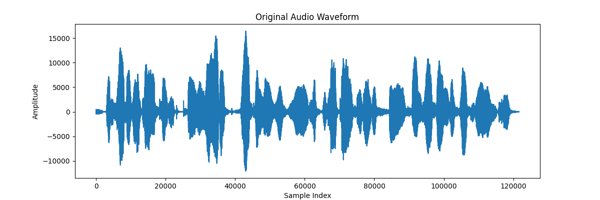
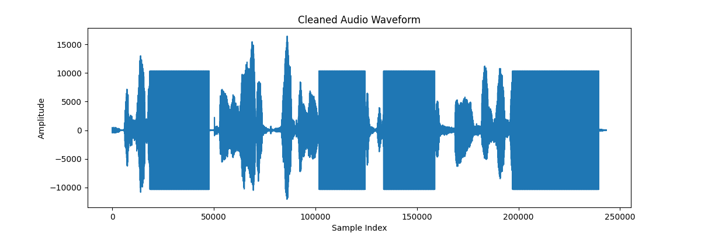
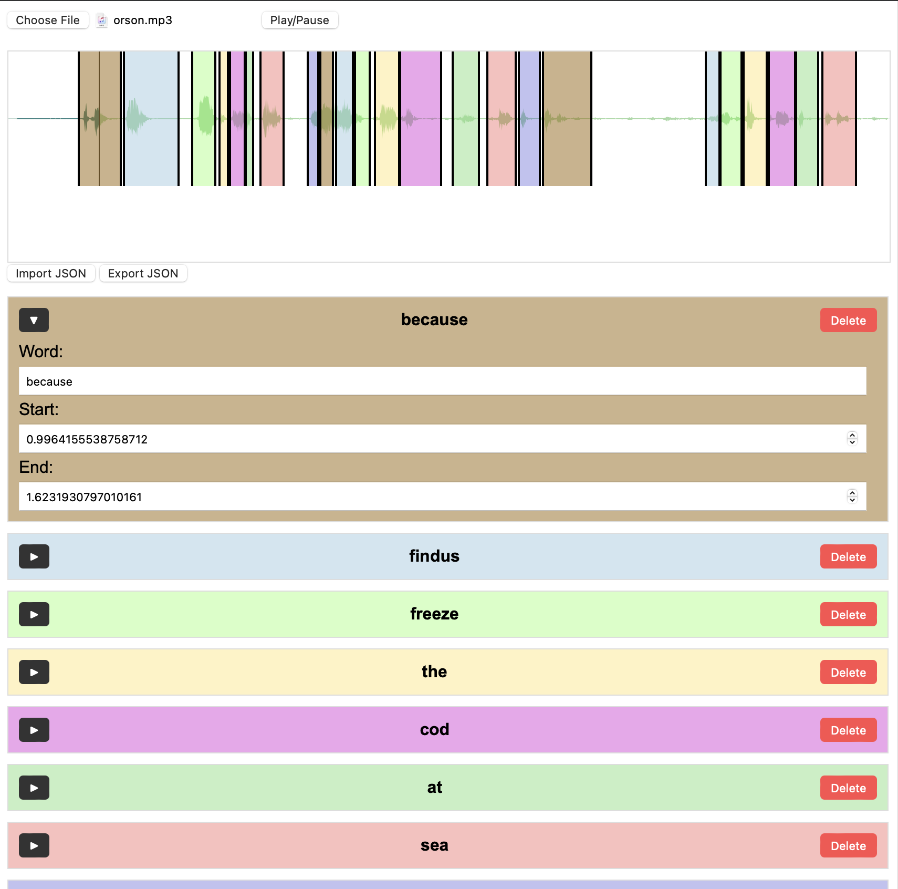
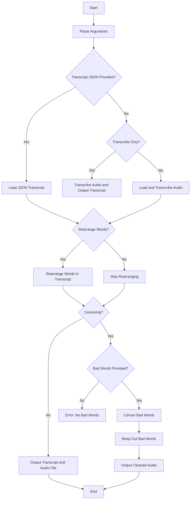

# Speech Censoring & Manipulation

Here's a [very rudimentary](https://www.google.com/search?q=define:jank) program for censoring and rearranging speech sounds in an audio file.  It supports multiple input formats and has several options.

This program processes an audio file, identifies specified words, and censors them by replacing them with beeps. Optionally, the [words may be rearranged](https://youtu.be/LzoNAsXELBk?t=1369) by supplying a text file with the desired speech output. The transcript can be returned without censoring if desired.

## Requirements

- Python 3
- [pydub](https://pypi.org/project/pydub/)
- [vosk](https://alphacephei.com/vosk/)
    - The smallest (40M) en-US model can be used (YMMV). The larger (1.8G) model might be more accurate.  Download the desired model from [here](https://alphacephei.com/vosk/models), and put it in the project directory.
- argparse
- wave
- datetime
- json

## Installation

Install the required Python libraries using `pip`:

```sh
pip install pydub vosk argparse
```

## Usage

To run the script:

```sh
./audio-censor.py --audio_file <path_to_audio_file> --model_path <path_to_vosk_model> [OPTIONS]
```

The larger vosk models take longer to use, obviously

## Examples

Here are some examples, which use this example audio from the Speech Synthesis group at [Kungliga Tekniska Högskolan](https://www.speech.kth.se/) (KTH):

https://github.com/user-attachments/assets/b1306668-777e-4ec1-9afa-45a2cb287378

```text
it had established periodic regular review of the status of four hundred individuals
```

### Example 1 command

We will censor the words "established", "review", "status", and "individuals".

```sh
./audio-censor.py --audio_file examples/mat.mp3 --bad_words_file examples/mat_redact.csv --model_path vosk-model-small-en-us-0.15/ --output_format aiff
```

### Example 1 output

```text
Audio file: examples/mat.mp3
Model path: vosk-model-small-en-us-0.15/
Loaded audio file examples/mat.mp3, duration: 5515 ms, frame_count=121600.0
Audio segment before export: duration=5515 ms, frame_count=88236.0
Exported audio to temp.wav
temp.wav properties: channels=1, sample_width=2, frame_rate=16000, frames=88236
Raw transcript:
it had established periodic regular review of the status of four hundred individuals
Loaded bad words: ['established', 'review', 'status', 'individuals']
Censored Transcript:
it had [redacted] periodic regular [redacted] of the [redacted] of four hundred [redacted]
```

https://github.com/user-attachments/assets/4bd87624-c994-4e60-8f66-bbec7a3e70d1




### Example 2 command

We will rearrange the words to say something else"

```text
it had established review of this periodic regular status of four hundred established individuals review status periodic it had
```

```sh
./audio-censor.py --audio_file examples/mat.mp3 --model_path vosk-model-small-en-us-0.15/ --new_transcript examples/mat_new.txt --nocensor
```

### Example 2 output

```text
Audio file: examples/mat.mp3
Model path: vosk-model-small-en-us-0.15/
Loaded audio file examples/mat.mp3, duration: 5515 ms, frame_count=121600.0
Audio segment before export: duration=5515 ms, frame_count=88236.0
Exported audio to temp.wav
temp.wav properties: channels=1, sample_width=2, frame_rate=16000, frames=88236
Raw transcript:
it had established periodic regular review of the status of four hundred individuals
Loaded new transcript: ['it', 'had', 'established', 'review', 'of', 'the', 'periodic', 'regular', 'status', 'of', 'four', 'hundred', 'established', 'individuals', 'review', 'status', 'periodic', 'it', 'had']
Audio segment before export: duration=8100 ms, frame_count=129600.0
Exported audio to temp.wav
temp.wav properties: channels=1, sample_width=2, frame_rate=16000, frames=129600
New Transcript: it had established review of this periodic regular status of four hundred established individuals review status periodic it had
Transcript Without Censoring:
it had established review of this periodic regular status of four hundred established individuals review status periodic it had
Saved rearranged audio to mat_rearranged_20240716_215400.mp3
```

https://github.com/user-attachments/assets/5e2de996-fb2d-4fa6-980f-94e0c4a48ff2

The supplied "new transcript" is gibberish but demonstrates the rearrangement functionality.

### Example 3 command

We will attempt to make Orson Welles' job a bit easier.

```sh
./audio-censor.py --audio_file examples/orson.mp3 --model_path vosk-model-en-us-0.22/ --bad_words examples/mat_redact.csv --new_transcript examples/orson_new.txt
```

#### Input file

https://github.com/user-attachments/assets/b4e5671c-d228-42ca-9474-927b1781b5c5

```text
because Findus freeze the cod at sea and then add a crumb crisp ooh crumb crisp coating ah that's tough crumb crisp coating
```

### Example 3 output

```text
$ ./audio-censor.py --audio_file examples/orson.mp3 --model_path vosk-model-en-us-0.22/ --bad_words examples/mat_redact.csv --new_transcript examples/orson_new.txt
Audio file: examples/orson.mp3
Model path: vosk-model-en-us-0.22/
Loaded audio file examples/orson.mp3, duration: 12584 ms, frame_count=554944.0
Audio segment before export: duration=12584 ms, frame_count=201340.0
Exported audio to temp.wav
temp.wav properties: channels=1, sample_width=2, frame_rate=16000, frames=201340
Raw transcript:
it's an endless freeze the car to see and then add crumb crust crumb crisp coating let's cut from crisp coating
Loaded bad words: ['established', 'review', 'status', 'individuals']
Loaded new transcript: ['because', 'Findus', 'freeze', 'the', 'cod', 'at', 'sea', 'and', 'then', 'add', 'a', 'crisp', 'coating']
Word 'because' not found in the original transcript.
Word 'Findus' not found in the original transcript.
Word 'cod' not found in the original transcript.
Word 'at' not found in the original transcript.
Word 'sea' not found in the original transcript.
Word 'a' not found in the original transcript.
Audio segment before export: duration=2100 ms, frame_count=33600.0
Exported audio to temp.wav
temp.wav properties: channels=1, sample_width=2, frame_rate=16000, frames=33600
New Transcript: i use them and add coffee
Censored Transcript:
i use them and add coffee
Saved cleaned audio to orson_cleaned_20240716_215919.mp3
```

As you can see, the recognition does not really understand Orson Welles and parses his speech incorrectly.

https://github.com/user-attachments/assets/6dd0df5b-fd39-4617-9d00-d1099577054e

So, we can use the [web app](web_transcribe/index.html) to manually transcribe the audio file:



... and then use the resulting JSON file as a manual transcription, so that we get the desired output audio:

```sh
./audio-censor.py --audio_file examples/orson.mp3 --model_path vosk-model-small-en-us-0.15 --new_transcript examples/orson_new.txt --nocensor --transcript_json_path examples/orson_transcript.json
```

```text
Audio file: examples/orson.mp3
Model path: vosk-model-small-en-us-0.15
Loaded audio file examples/orson.mp3, duration: 12584 ms, frame_count=554944.0
Raw transcript:
because findus freeze the cod at sea and then add a crumb crisp ooh crumb crisp coating ah that's tough crumb crisp coating
Loaded new transcript: ['because', 'findus', 'freeze', 'the', 'cod', 'at', 'sea', 'and', 'then', 'add', 'a', 'crisp', 'coating']
Audio segment before export: duration=4419 ms, frame_count=70702.0
Exported audio to temp.wav
temp.wav properties: channels=1, sample_width=2, frame_rate=16000, frames=70702
Saved rearranged audio to orson_rearranged_20240717_010213.mp3
```

https://github.com/user-attachments/assets/3a8fc632-3f09-40d8-ad77-c0ec9c0038a0


## Workflow Diagram




## Errata

Probably many. Raise an issue in this repository if you want, but there's no guarantee it will ever be fixed.
The argument parsing and a bunch of other things need improvement but for a prototype [this is fine](https://knowyourmeme.com/memes/this-is-fine)

## To Do

- Improve stylesheet of web transcription interface

## License & Whatever

Copyright (c) 2024 T E Vaughan

[Schrödinger License](license.md)
